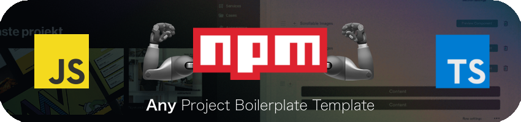

<p align="center">
    
</p>

# 🛠 Any Project Template Boileplate

Enhanced Zustand to query HTTP API Requests, including loading state and error handling with Zustand, without any extra data-fetching library

## Features

- NPM package.json configured including meta parameters
- Customized VSCode configuration (See `.vscode` folder)
- [ESLint](https://www.npmjs.com/package/eslint) & [Prettier](https://www.npmjs.com/package/prettier)
- Pre-Commit and Commit [Husky](https://github.com/typicode/husky) hooks (Runs linter and formatter before any commit)
- Commit nomenclature rules following [Conventional Commit Format](https://commitlint.js.org/) and [Commitizen CLI](https://github.com/commitizen/cz-cli) (🚀 emoji [powered](https://github.com/folke/devmoji))
- Release management policy with [standard-version](https://github.com/conventional-changelog/standard-version), including automatic CHANGELOG.md generation and automatic version bumping including GitTags (Now migrated to [commit-and-tag-version](https://github.com/absolute-version/commit-and-tag-version))
- Easy customizable README.md
- Included [npm-check](https://www.npmjs.com/package/npm-check) to check for outdated, incorrect, and unused dependencies.
- Included [better-npm-audit](https://www.npmjs.com/package/better-npm-audit) to check for dependency vulnerabilities

### Set up and run locally

```
npm ci               # Install dependencies
npm run dev          # Launch project locally
```

## Linter & Formatter

```
npm run lint         # Run ESLint
npm run format       # Run Prettier
```

## Git Commit with Commitizen

```
git add .            # Add files
npm run cz           # Commit with Commitizen CLI
```

## Release a new version

```
npm run release             # Bump version and generate CHANGELOG.md
git push --follow-tags      # Push changes and GitTag to origin
```

## Check vulnerabilities and update outdated dependencies

```
npm run npm:audit     # Check dependency vulnerabilities
npm run npm:check     # Check outdated dependencies
```
